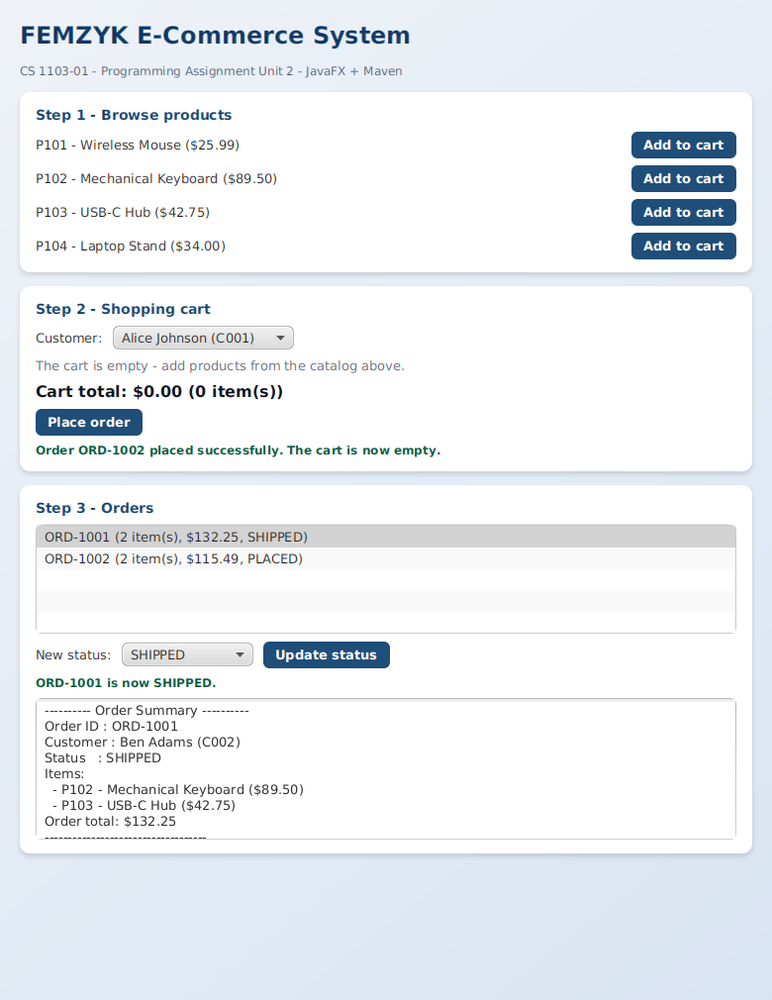
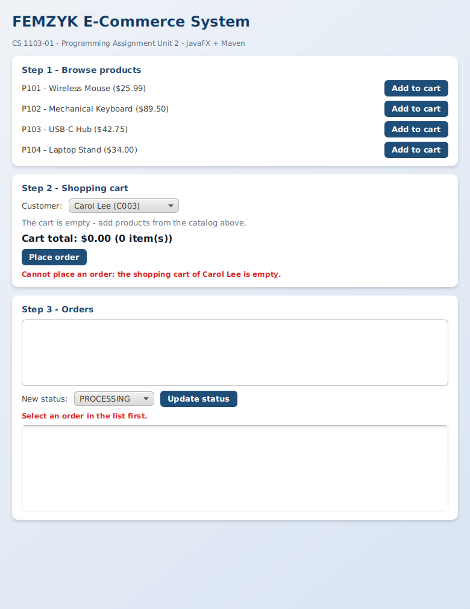
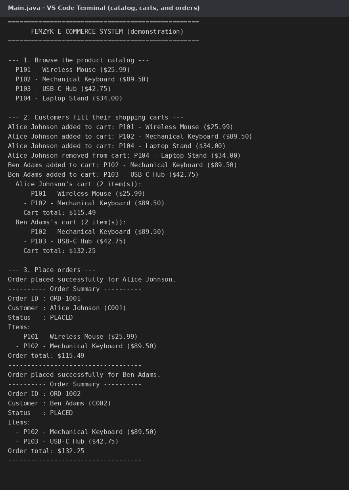
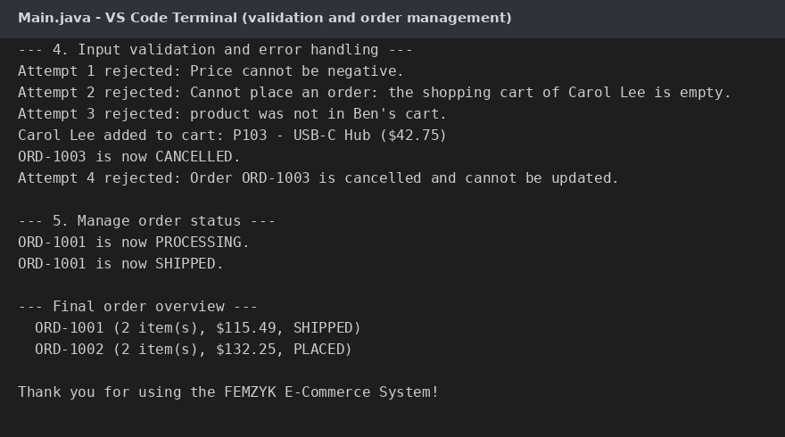

# FEMZYK E-Commerce System

A **simple e-commerce system** built for *CS 1103-01 – Programming Assignment Unit 2*:
customers can browse products, fill a shopping cart, and place orders — through a styled
**JavaFX front end** or a **console demonstration**. The focus of the assignment is
**organizing code with Java packages and the import statement** for proper encapsulation.

🔗 **Repository:** https://github.com/FEMZYKENTLTD/FEMZYK-ECommerceSystem



## 📦 Packages and classes

| Package | Class | Purpose |
|---------|-------|---------|
| `com.ecommerce` | `Product` | A product for sale: `productID`, `name`, `price` with validated constructor, getters and setters |
| `com.ecommerce` | `Customer` | A customer with a private shopping cart: add/remove products, calculate the total, place orders |
| `com.ecommerce.orders` | `Order` | An order: `orderID`, `customer`, `products`, `orderTotal`, status management and order summaries |
| `com.ecommerce.gui` | `Launcher`, `ECommerceApp` | The JavaFX front end, which imports and reuses the exact same domain classes |
| *(default package)* | `Main` | Console demonstration that **imports** the domain classes and runs the whole scenario |

The `Main` class sits **outside** the packages and brings the classes in with the import
statement, exactly as the assignment requires:

```java
import com.ecommerce.Customer;
import com.ecommerce.Product;
import com.ecommerce.orders.Order;
```

## 📁 Project layout

```
FEMZYK-ECommerceSystem/
├── pom.xml                                              Maven build file (JavaFX + plugins)
├── docs/                                                Screenshots used by this README
└── src
    ├── main/java
    │   ├── com/ecommerce
    │   │   ├── Product.java                             Product class (com.ecommerce package)
    │   │   ├── Customer.java                            Customer class with shopping cart
    │   │   ├── orders/Order.java                        Order class (com.ecommerce.orders)
    │   │   └── gui
    │   │       ├── Launcher.java                        Entry point for the JavaFX front end
    │   │       └── ECommerceApp.java                    JavaFX user interface
    │   └── Main.java                                    Console demonstration (outside the packages)
    ├── main/resources/com/ecommerce/gui
    │   └── styles.css                                   JavaFX stylesheet
    └── test/java/com/ecommerce/gui
        └── SnapshotRunner.java                          Dev utility that captures the GUI screenshots
```

## ✅ Requirements

- **JDK 17 or newer** (built and tested on JDK 25 with JavaFX 26)
- **Maven 3.8+**
- VS Code users: the **Extension Pack for Java** extension

## 🚀 Build and run

```bash
# 1. compile and package (clean build: no errors, no warnings)
mvn clean package

# 2. run the JavaFX graphical front end
mvn javafx:run

# 3. run the console demonstration instead (after mvn package)
java -cp target/femzyk-ecommerce-1.0.0.jar Main
```

In VS Code: open the project folder, wait for the Java extension to load it, then open
`Launcher.java` (GUI) or `Main.java` (console) and click **Run** above the `main` method
(or press **F5**).

## 🖼 The graphical front end

The window mirrors the store scenario in three steps: browse the catalog and add products
to a cart, switch customers and manage their carts (remove items, see the live total, place
orders), and manage the resulting orders (status updates and full order summaries).
Empty-cart orders and other invalid actions are rejected with clear messages:



The console demonstration performs the same scenario step by step:



## 🔎 Input validation and error handling

Both front ends deliberately perform invalid operations and show that each one is rejected
with a clear, handled message:

| Invalid operation | Result |
|-------------------|--------|
| Creating a product with a negative price | `IllegalArgumentException: Price cannot be negative.` |
| Creating a product/customer with an empty ID or name | `IllegalArgumentException` |
| Placing an order with an empty shopping cart | `IllegalStateException` |
| Removing a product that is not in the cart | Returns `false`, reported by the program |
| Updating an order after it was cancelled | `IllegalStateException` |



## 🔒 Encapsulation highlights

- All fields are `private`; IDs are `final` (immutable after creation).
- Setters and constructors validate inputs, so invalid objects can never exist.
- The cart and order product lists are exposed only as **unmodifiable views**
  (`Collections.unmodifiableList`), and `Order` makes a **defensive copy**.
- `Order` generates unique IDs (`ORD-1001`, `ORD-1002`, ...) with a private static counter.

## 📚 Academic context

Course project for **CS 1103-01 – AY2027-T1, Programming Assignment Unit 2**
(University of the People). Built with Maven and JavaFX; compiled with a clean
`BUILD SUCCESS` (no errors, no warnings).
